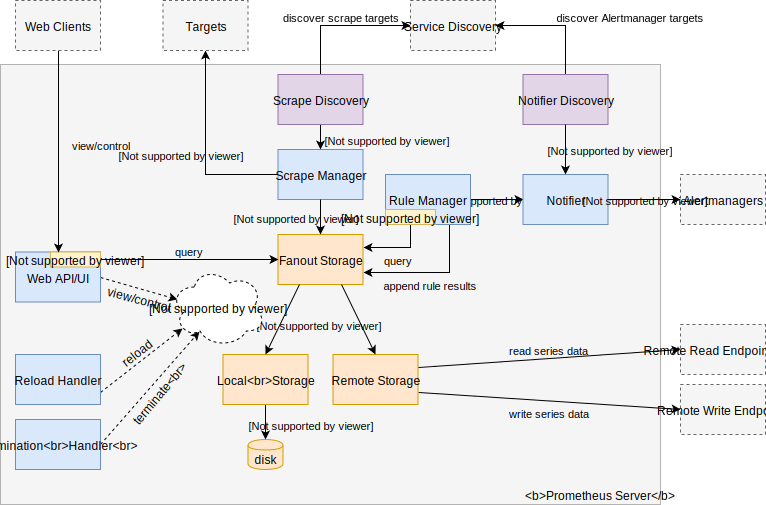

# 内部架构

Prometheus服务器由许多内部组件组成，这些组件协同工作以实现Prometheus的整体功能。 本文档概述了主要组件，包括它们如何组合在一起以及指向实现细节的指针。 如果你是一个新手，并希望对其有一个大概的了解，那么请从此处开始。

整个Prometheus架构如下图所示:

**注意**: 箭头表示请求或连接流转的方向，其对应的不一定是数据流。

以下部分将解释图中的每个组件。 代码链接和说明基于Prometheus 2.3.1版。 未来的Prometheus代码版本可能会有所不同。

## 程序入口方法

 [`main()` function](https://github.com/prometheus/prometheus/blob/v2.3.1/cmd/prometheus/main.go#L77-L600) 方法初始化并运行所有其他Prometheus服务器组件。它还将相互依赖的组件连接起来。
作为第一步，`main（）`定义服务器的命令行参数并将其解析为[本地配置结构](https://github.com/prometheus/prometheus/blob/v2.3.1/cmd/prometheus/main.go＃L83-L100)，同时对某些值执行额外的清理和初始化。
请注意，此基于标志的配置结构独立于稍后从配置文件中读取的配置（由`--config.file`标志提供）。
Prometheus区分基于标志的配置和基于文件的配置：标志用于不支持在没有服务器重启的情况下进行更新的简单设置，而配置文件中提供的任何设置都必须支持在不重新启动整个服务器的情况下重新加载。

接下来，`main（）`实例化Prometheus的所有主要运行时组件，并使用通道，引用或传入上下文将它们连接在一起，以便以后协调和取消。这些组件包括服务发现，目标抓取，存储等（如本文档的其余部分有详细叙述）。

最后，服务器[运行所有组件](https://github.com/prometheus/prometheus/blob/v2.3.1/cmd/prometheus/main.go#L366-L598)在[类似actor的模型](https ：//www.brianstorti.com/the-actor-model/)，
使用[`github.com/oklog/oklog/pkg/group`](https://godoc.org/github.com/oklog/run)协调所有互连的角色的启动和关闭。多个通道用于强制执行排序约束，例如在存储准备就绪并且初始配置文件加载已发生之前不启用Web界面。

## 配置

配置子系统负责读取，验证和应用由`--config.file`参数指定的YAML配置文件。 [请参阅文档](https://prometheus.io/docs/prometheus/latest/configuration/configuration/)以获取所有配置项的说明。
Prometheus具有读取和应用配置文件的功能，它有一个goroutine（轻量级线程），用于监视从同一文件重新加载配置的请求。 两种机制概述如下。

### 配置的读取和解析

加载初始配置或后续重新加载时，Prometheus调用[`config.LoadFile（）`](https://github.com/prometheus/prometheus/blob/v2.3.1/config/config.go#L52-L64)函数从文件读取其配置，
并将其解析为[`config.Config`结构体](https://github.com/prometheus/prometheus/blob/v2.3.1/config/config.go#L133-L145)。 此结构体包含了所有组件的配置。
它包含的子结构体对应着配置文件的分支。 每个配置结构体都有一个[默认配置]（https://github.com/prometheus/prometheus/blob/v2.3.1/config/config.go#L66-L131）以及一个解析它的`UnmarshalYAML（）`方法，
其可以做进一步的有效性检查或初始化。在配置完全解析和验证后，将返回生成的配置结构体。

### Reload handler

[Reload handler](https://github.com/prometheus/prometheus/blob/v2.3.1/cmd/prometheus/main.go#L443-L478)是一个直接在`main()`中实现的goroutine。 
并从Web界面或[`HUP`信号](https://en.wikipedia.org/wiki/Signal_(IPC)#SIGHUP)监听配置重新加载请求。 
当它收到重新加载请求时，它会使用`config.LoadFile（）`从磁盘重新读取配置文件，并将生成的`config.Config`结构体应用于所有的组件。
另外，也可以[通过调用它们的`ApplyConfig （）`方法或通过调用自定义重新加载函数来实现配置刷新](https://github.com/prometheus/prometheus/blob/v2.3.1/cmd/prometheus/main.go#L302-L341)。

## Termination handler

[Termination handler](https://github.com/prometheus/prometheus/blob/v2.3.1/cmd/prometheus/main.go#L367-L392)是一个直接在`main（）`中实现的goroutine。 侦听来自Web界面或[`TERM`信号](https://en.wikipedia.org/wiki/Signal_(IPC))SIGTERM)的终止请求。 当它收到终止请求时，它通过[`github.com/oklog/oklog/pkg/group`](https://godoc.org/github.com/oklog/run)提供的参与者协调功能触发所有其他Prometheus组件的有序关闭。

## Scrape discovery manager

Scrape discovery manager 底层是一个[`discovery.Manager`](https://github.com/prometheus/prometheus/blob/v2.3.1/discovery/manager.go#L73-L89)结构体，
它使用Prometheus的服务发现功能来查找并不断更新Prometheus的目标列表。它独立于scrape manager（执行实际的目标擦除）运行，并通过存在于[synchronization channel](https://github.com/prometheus/prometheus/blob/v2.3.1/cmd/prometheus/main.go#L431)的[target group](https://github.com/prometheus/prometheus/blob/v2.3.1/discovery/targetgroup/targetgroup.go＃L24-L33)**更新流**来进行服务的维护。

在内部，scrape discovery manager在其自己的goroutine中为每个服务发现配置项运行一个实例。例如，如果配置文件中的`scrape_config`定义了两个[`kubernetes_sd_config`](https://prometheus.io/docs/prometheus/latest/configuration/configuration/#%3Ckubernetes_sd_config%3E)，
那么管理器将运行两个单独的[`kubernetes.Discovery`](https://github.com/prometheus/prometheus/blob/v2.3.1/discovery/kubernetes/kubernetes.go#L150-L159)实例。
每个实例都实现[`discovery.Discoverer`接口](https://github.com/prometheus/prometheus/blob/v2.3.1/discovery/manager.go#L41-L55)，并通过同步通道发送目标更新指令给 scrape discovery manager，然后scrape discovery manager会更新目标的信息，并将其转发给scrape管理器。

应用的配置更改后，scrape discovery manager 将停止所有当前运行的发现实例，并启动新配置文件中定义的新实例。

详细信息请参阅[服务发现内部机制文档](https://github.com/prometheus/prometheus/blob/master/discovery/README.md)。

## Scrape manager

Scrape manager 底层是一个[`scrape.Manager`](https://github.com/prometheus/prometheus/blob/v2.3.1/scrape/manager.go#L47-L62)结构体，
它负责从发现的监控目标对象抓取指标，并将采集到的样本转发到存储子系统。

### Target updates and overall architecture

与 Scrape discovery manager 为每个`scrape_config`运行一个发现机制的方式相同，scrape manager 为每个这样的配置项运行相应的scrape pool。 
两者都通过配置项的`job_name`字段识别这些配置项（ ==例如跨重载和跨两个组件== 没懂），该字段在给定的配置文件中必须是唯一的。 
scrape discovery manager通过同步通道将每个`scrape_config`的目标更新发送给scrape manager，[然后将这些更新应用到相应的scrape池](https://github.com/prometheus/prometheus/blob/v2.3.1/scrape/manager.go#L150-L173)。
每个 scrape pool 依次为每个目标运行一个刮擦循环。 整体层次结构如下所示：

* Scrape manager
  * Scrape pool for `scrape_config` 1
    * Scrape loop for target 1
    * Scrape loop for target 2
    * Scrape loop for target 3
    * [...]
    * Scrape loop for target n
  * Scrape pool for `scrape_config` 2
    * [...]
  * Scrape pool for `scrape_config` 3
    * [...]
  * [...]
  * Scrape pool for `scrape_config` n
    * [...]

### Target labels and target relabeling

每当scrape manager 从scrape discovery manager 接收给定scrape pool 的更新目标列表时，scrape pool将默认的标签（例如`job`和`instance`）应用于每个目标metric，
然后应用[relabeling 配置](https://prometheus.io/docs/prometheus/latest/configuration/configuration/#%3Crelabel_config%3E)生成目标的最终标签列表。

### Target hashing and scrape timing

在scrape_configs刮擦间隔内， ==在scrape pool内以一致的开槽方式展开刮擦== 没懂，每个目标都是[其标签集及其最终刮擦URL的哈希值](https://github.com/prometheus/prometheus/blob/v2.3.1/scrape/target.go＃L75-L82)。
然后，该哈希值用于在该间隔内[选择确定性偏移](https://github.com/prometheus/prometheus/blob/v2.3.1/scrape/target.go#L84-L98)。

### Target scrapes

最后，scrape loop 定期通过HTTP抓取其目标，并尝试根据[Prometheus基于文本的指标展示格式](https://prometheus.io/docs/instrumenting/exposition_formats/)解码收到的HTTP响应。
然后，它将[metric relabeling 配置](https://prometheus.io/docs/prometheus/latest/configuration/configuration/#%3Cmetric_relabel_configs%3E)应用于每个单独的样本，
并将生成的样本发送到存储子系统。此外，它还可以跟踪和存储多次刮擦运行时间序列的陈旧性，记录[刮取健康信息](https://prometheus.io/docs/concepts/jobs_instances/#automatically-generated-labels-and-time-series)（例如`up`和`scrape_duration_seconds`指标），
并执行其他任务以优化向存储引擎添加时间序列。请注意，scrape不允许花费比配置的scrape间隔更长的时间，并且可配置的scrape超时限制为该值。这确保了在另一个刮擦开始之前终止一个刮擦。

## Storage

Prometheus将时间序列样本存储在本地时间序列数据库（TSDB）中，并且可选地还将所有样本的副本转发到一组可配置的远程端点。
同样，Prometheus从本地TSDB读取数据，也可以从远程端点读取数据。 本地和远程存储子系统都在下面解释。

### Fanout storage

[fan-out storage](https://github.com/prometheus/prometheus/blob/v2.3.1/storage/fanout.go#L27-L32) 底层是一个[`storage.Storage`](https://github.com/prometheus/prometheus/blob/v2.3.1/storage/interface.go＃L31-L44)结构体，实现代理和抽象出 local storage 和 remote storage 子系统的细节以供其他组件使用。
对于读取，它合并来自本地和远程源的查询结果，而写入则复制样本到所有本地和远程目标。 在内部，fan-out storage 区别于 主（本地）存储 和 可选的辅助（远程）存储，是因为它们具有不同的用于优化时间序列获取的能力。

目前，告警规则仍然直接从fan-out storage读取和写入，但这很快将会更改成为规则默认只读取本地数据。 这是为了提高警报和记录规则的可靠性，在大多数情况下它们只需要短期数据。

### Local storage

Prometheus的本地磁盘时间序列数据库是一个对[prometheus/tsdb.DB](https://github.com/prometheus/tsdb/blob/master/db.go#L92-L117)的[轻量级包装](https://github.com/prometheus/prometheus/blob/v2.3.1/storage/tsdb/tsdb.go#L102-L106)。 
在Prometheus中使用它时，我们只对接口做了很少的调整，并实现了[`storage.Storage`接口]（https://github.com/prometheus/prometheus/blob/v2.3.1/storage/interface.go#L31-L44）。 您可以在[本地存储文档](https://prometheus.io/docs/prometheus/latest/storage/)中找到有关TSDB磁盘布局的更多详细信息。

### Remote storage

远程存储底层是一个[`remote.Storage`](https://github.com/prometheus/prometheus/blob/v2.3.1/storage/remote/storage.go#L31-L44)结构体，它实现了[`storage.Storage`接口](https://github.com/prometheus/prometheus/blob/v2.3.1/storage/interface.go#L31-L44)，负责与远程读写端点连接。

对于配置文件中的每个[`remote_write`](https://prometheus.io/docs/prometheus/latest/configuration/configuration/#%3Cremote_write%3E)配置项，远程存储创建并运行一个[`remote.QueueManager `](https://github.com/prometheus/prometheus/blob/v2.3.1/storage/remote/queue_manager.go#L141-L161)，它依次排队并将样本发送到特定的远程写端点。
每个队列管理器通过观察当前和过去的负载来动态确定分片的数量以并行化对远程端点写入。 应用配置重新加载时，将关闭所有远程存储队列并创建新的。

对于配置文件中的每个[`remote_read`](https://prometheus.io/docs/prometheus/latest/configuration/configuration/#%3Cremote_read%3E)配置项，远程存储创建[reader client](https： //github.com/prometheus/prometheus/blob/v2.3.1/storage/remote/storage.go#L96-L118)并合并每个远程源的读取结果。

## PromQL engine

[PromQL引擎](https://github.com/prometheus/prometheus/blob/v2.3.1/promql/engine.go#L164-L171)负责通过时间序列数据库来解析运行[PromQL表达式查询](https://prometheus.io/docs/prometheus/latest/querying/basics/)。
PromQL engine没有自己的actor goroutine，而是作为Web界面和规则管理器中的库存在。
PromQL evaluate分多个阶段进行：
    1. 创建查询时，其表达式被解析为抽象语法树，并生成可执行查询语句。 
    2. 后续执行阶段首先查找并从底层存储创建必要时间序列迭代器。
    3. 然后它会在迭代器上解析执行PromQL表达式。 
实际时间序列批量数据检索是 lazily evaluate 的（至少在本地TSDB的情况下）。 表达式评估返回PromQL表达式类型，最常见的是时间序列的即时向量或范围向量。

## Rule manager

规则管理器底层是一个[`rules.Manager`](https://github.com/prometheus/prometheus/blob/v2.3.1/rules/manager.go#L410-L418)结构体，负责周期性（`evaluation_interval`配置项）的评估记录和警报规则。 每次使用PromQL和时间序列写入存储时，它会在每次迭代上evaluate所有规则。

对于告警规则, rule manager在每次迭代都会做以下操作:

- 它为所有待处理或已触发的告警保存这样一条序列：`ALERTS {alertname =”<alertname>“，<alert labels>}`。
- 它跟踪活动警报的生命周期状态，以决定何时将警报从挂起转换为触发（取决于警报规则中的`for`持续时间）。
- 它会按照告警规则里面配置的为每个活跃的告警添加标签和注释模板。
- 它向通知程序发送触发警报（见下文）并持续发送已解决的警报15分钟。

## Notifier

Notifier底层是一个[`notifier.Manager`](https://github.com/prometheus/prometheus/blob/v2.3.1/notifier/notifier.go#L104-L119)结构体，它通过其`Send（）`方法将rule manager生成的警报排队发送到所有配置的Alert Manager实例。 
Notifier用于将警报的生成与将它们分派给Alert Manager（可能失败或耗时很长）解耦。
## Notifier discovery

通知程序发现管理器底层是一个[`discovery.Manager`](https://github.com/prometheus/prometheus/blob/v2.3.1/discovery/manager.go#L73-L89)结构体，它使用Prometheus的服务发现功能来查找并不断更新 Notifier 应向其发送警报的Alertmanager实例列表。
它独立于Notifier运行，并通过[同步通道]为其提供目标组更新流（https://github.com/prometheus/prometheus/blob/v2.3.1/cmd/prometheus/main.go#L587）。
其内部机制与 scrape discovery manager 类似.

## Web UI and API

默认情况下，Prometheus在端口“9090”上提供其Web UI和API。 Web UI提供人工可用的界面，用于运行表达式查询，检查活跃警报或获取有关Prometheus服务器的状态信息。

web API 在`/api/v1`下，并提供了这些对外的接口 [querying, metadata, and server status inspection](https://prometheus.io/docs/prometheus/latest/querying/api/).

[Console templates](https://prometheus.io/docs/visualization/consoles/)允许用户通过自定义的HTML模板去访问TSDB数据，当配置了控制台模板时，它们在`/ consoles`下。
